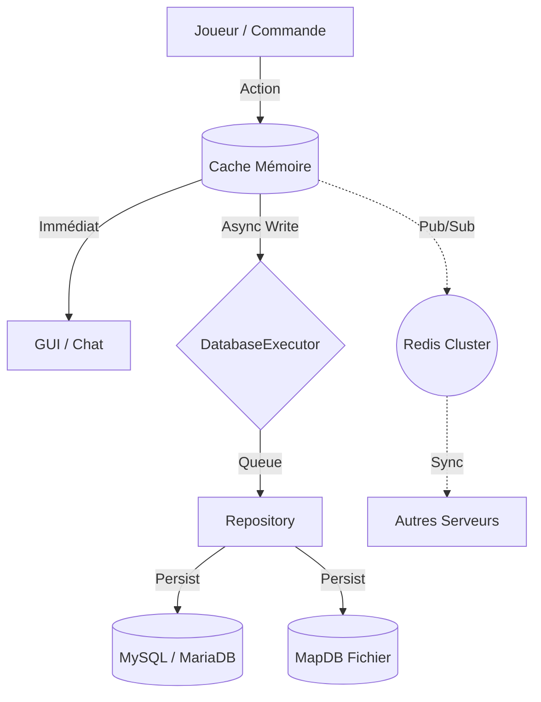

# Architecture Technique - TradeFlow v2.0

## 🏗️ Vue d'Ensemble

TradeFlow est conçu pour être **performant**, **scalable** et **résilient**.
L'architecture suit le pattern **Repository** combiné à un système de **Write-Behind Asynchrone**.

### 📊 Diagramme de Flux de Données

---

## 🛡️ Couche de Données (Data Layer)

### 1. Le Pattern Repository
Toute interaction avec les données passe par des interfaces strictes :
*   `ShopRepository`
*   `TransactionRepository`
*   `LoanRepository`
*   `EconomyDataRepository`

Cela nous permet de changer de moteur de stockage (MapDB vs MySQL) sans toucher au code métier.

### 2. Async Write-Behind (Performance)
Pour éviter le moindre lag serveur (freeze), aucune écriture en base de données ne se fait sur le thread principal.
*   **Lecture :** Synchrone (depuis le Cache Mémoire `LoadedShops`).
*   **Écriture :** Asynchrone (via `DatabaseExecutor`).

### 3. Graceful Shutdown (Sécurité)
Le `DatabaseExecutor` utilise un pool de threads dédié. Lors de l'arrêt du serveur, le plugin attend (jusqu'à 30s) que toutes les écritures en attente soient terminées avant de couper la connexion.
**Résultat :** Zéro corruption de données, même en cas de `/stop` brutal.

---

## 🌐 Clustering & Redis

TradeFlow supporte le multi-serveur (ex: réseau BungeeCord).
*   **Technologie :** Redis Pub/Sub.
*   **Fonctionnement :** Quand un serveur modifie un prix, il envoie un message `ShopSyncMessage`.
*   **Réception :** Les autres serveurs mettent à jour leur cache mémoire instantanément, sans relire la base de données.

---

## 🚀 Guide Développeur

### Ajouter une nouvelle donnée
1. Créer l'objet métier (POJO).
2. Créer l'interface `MyRepository`.
3. Implémenter `MySQLMyRepository` et `MapDBMyRepository`.
4. Ajouter le champ dans `Database.java` et l'initialiser.

### Tests
Utiliser `gradlew test` pour lancer les tests unitaires (JUnit 5).
Les tests valident la logique mathématique et la sérialisation JSON.
