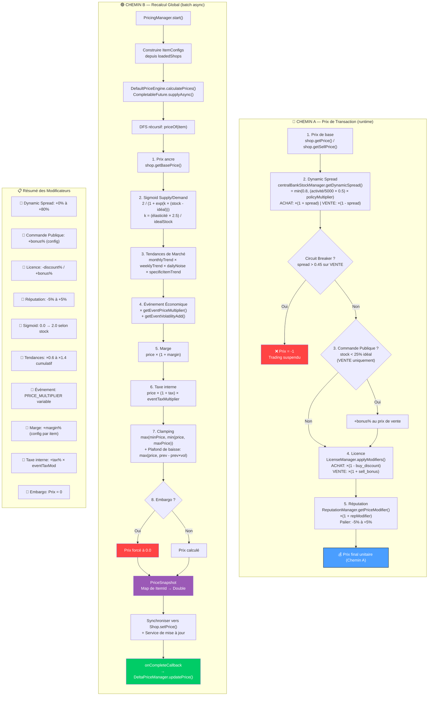
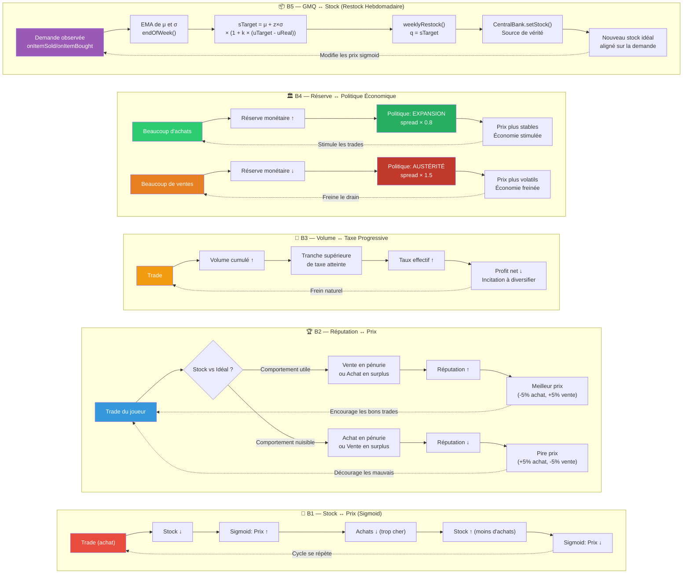
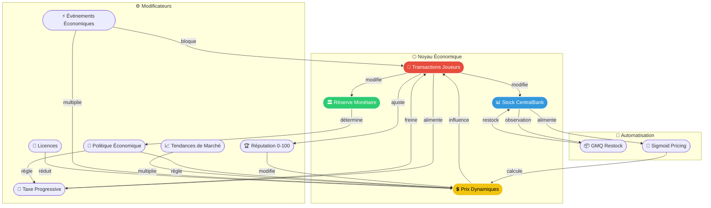
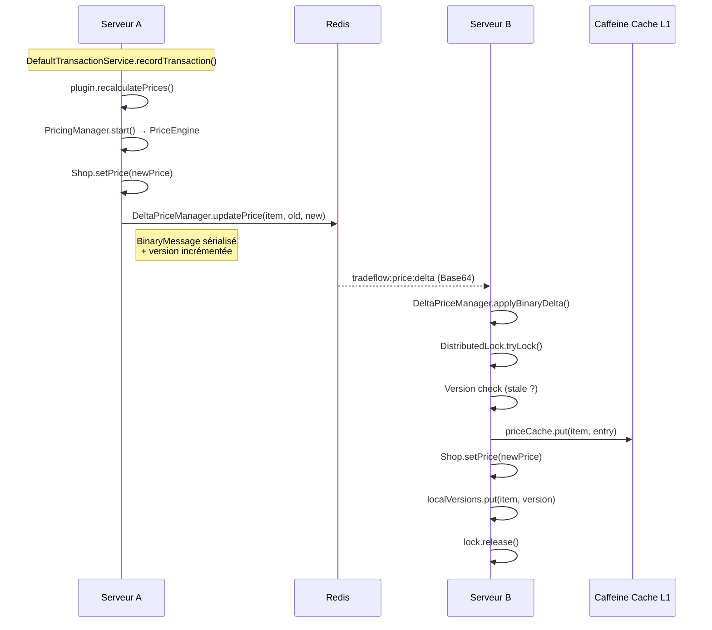
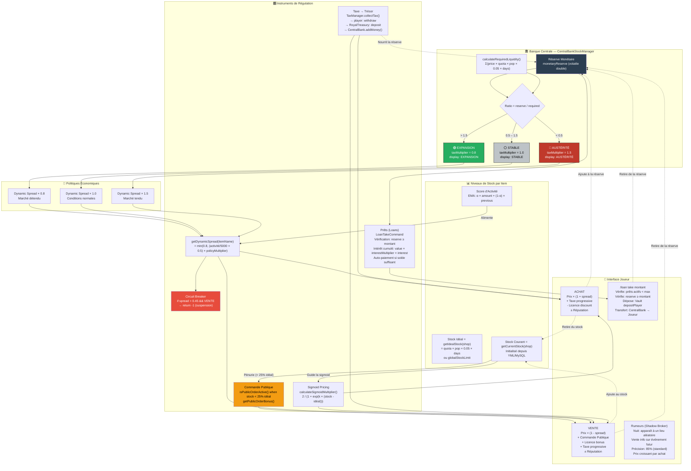
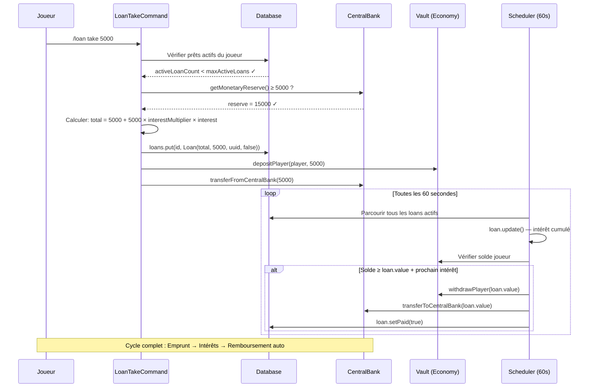

# TradeFlow — Diagrammes du Système Économique Complet

> Documentation technique de l'architecture économique de TradeFlow.
> Chaque diagramme Mermaid illustre un aspect du système avec les noms réels des classes et méthodes du code source.

---

## Table des matières

1. [Diagramme 1 — Flux principal d'une transaction (Achat & Vente)](#diagramme-1--flux-principal-dune-transaction)
2. [Diagramme 2 — Calcul complet du prix d'un item](#diagramme-2--calcul-complet-du-prix-dun-item)
3. [Diagramme 3 — Boucles de rétroaction économiques](#diagramme-3--boucles-de-rétroaction-économiques)
4. [Diagramme 4 — Architecture multi-serveur (Redis)](#diagramme-4--architecture-multi-serveur-redis)
5. [Diagramme 5 — Politique économique & régulation centrale](#diagramme-5--politique-économique--régulation-centrale)

---

## Diagramme 1 — Flux principal d'une transaction

Ce diagramme montre le parcours complet d'une transaction **ACHAT** et **VENTE** à travers tous les sous-systèmes.
L'orchestrateur est `TradeExecutionService.executePurchase()`.

### Explications

Le flux suit un ordre strict :

1. **Verrouillage** — `activeOperations` (ConcurrentHashMap) empêche les transactions concurrentes d'un même joueur.
2. **Résolution du Shop** — `ShopUtil.getShop()` cherche l'item dans la base.
3. **Calcul du prix** — `TradePricingService.calculateFinalPrice()` applique les modificateurs dynamiques (voir Diagramme 2).
4. **Validation** — `DefaultPurchaseValidationService.validatePurchase()` vérifie stock, quota, permissions.
5. **Inventaire** — `DefaultInventoryService` donne/retire les items physiques.
6. **Paiement** — `TradeEconomyService.processPayment()` effectue les transferts Vault + Banque Centrale.
7. **Taxe** — `TaxManager.collectTax()` collecte la taxe progressive vers le Trésor.
8. **Stock** — `CentralBankStockManager.recordBuy()/recordSale()` met à jour le stock virtuel.
9. **Réputation** — `ReputationManager.processTrade()` ajuste la réputation du joueur.
10. **Enregistrement** — `DefaultTransactionService.recordTransaction()` persiste + déclenche le recalcul des prix via `plugin.recalculatePrices()`.

```mermaid
flowchart TD
    subgraph Player["👤 Joueur"]
        P_START(["Commande /buy ou /sell"])
    end

    subgraph Lock["🔒 Verrouillage"]
        LOCK{"activeOperations.putIfAbsent()"}
        LOCK_WAIT["⏳ Attente — opération en cours"]
    end

    subgraph Resolution["🔍 Résolution"]
        RESOLVE["ShopUtil.getShop(name)"]
        SHOP_NULL["Shop introuvable → Message d'erreur"]
        GET_BASE["shop.getPrice() ou shop.getSellPrice()"]
    end

    subgraph Pricing["💰 Pricing — TradePricingService"]
        CALC["calculateFinalPrice(basePrice, isBuy, shop, player, name)"]
        SPREAD["Dynamic Spread<br/>centralBankStockManager.getDynamicSpread()"]
        CB{"Circuit Breaker<br/>spread > 0.45 && VENTE ?"}
        CB_REJECT["❌ Trading suspendu<br/>volatilité extrême"]
        PUB_ORDER{"Commande Publique ?<br/>stock < 25% idéal"}
        PUB_BONUS["+Bonus Commande Publique"]
        LICENSE["LicenseManager.applyModifiers()<br/>Remise catégorie"]
        REPUTATION["ReputationManager.getPriceModifier()<br/>Modificateur de palier"]
    end

    subgraph Validation["✅ Validation"]
        VALID["DefaultPurchaseValidationService.validatePurchase()"]
        VALID_FAIL["❌ Validation échouée"]
    end

    subgraph Inventory["📦 Inventaire"]
        GIVE["inventoryService.giveItem() — ACHAT"]
        TAKE["inventoryService.takeItem() — VENTE"]
    end

    subgraph Payment["🏦 Paiement — TradeEconomyService"]
        PAY_BUY["Vault: withdrawPlayer() + depositPlayer(bank)<br/>CentralBank: addMoney()"]
        PAY_SELL["Vault: withdrawPlayer(bank) + depositPlayer()<br/>CentralBank: removeMoney()"]
    end

    subgraph Tax["📜 Taxe — TaxManager"]
        TAX["collectTax(player, total, isBuy, name)"]
        TAX_CALC["Taxe progressive par volume cumulé<br/>+ Surcharge grandes transactions"]
        TAX_DEPOSIT["→ Trésor Royal + CentralBank.addMoney()"]
    end

    subgraph StockUpdate["📊 Stock — CentralBankStockManager"]
        STOCK_BUY["recordBuy(shop, amount)<br/>stock -= amount"]
        STOCK_SELL["recordSale(shop, amount)<br/>stock += amount"]
        ACTIVITY["updateActivity()<br/>EMA du score d'activité"]
    end

    subgraph RepUpdate["🏆 Réputation — ReputationManager"]
        REP["processTrade(player, shop, amount, isBuy)"]
        REP_LOGIC{"Contexte du trade"}
        REP_SCARCE_SELL["+2.0 Vente en pénurie"]
        REP_SURPLUS_SELL["-1.0 Dumping en surplus"]
        REP_SCARCE_BUY["-1.5 Thésaurisation en pénurie"]
        REP_NORMAL["+0.1 Trade normal"]
    end

    subgraph Recording["📝 Enregistrement — DefaultTransactionService"]
        RECORD["recordTransaction(player, shop, amount, total, isBuy)"]
        DB_SAVE["database.putTransaction()"]
        GDP["economyDataUtil.increaseEconomyData(GDP)"]
        GMQ_SELL["gmqService.onItemSold()"]
        GMQ_BUY["gmqService.onItemBought()"]
        REDIS_PUB["redisClient.publish(stock-updates)"]
        RECALC["🔄 plugin.recalculatePrices()"]
    end

    %% === FLOW ===
    P_START --> LOCK
    LOCK -->|Déjà verrouillé| LOCK_WAIT
    LOCK -->|Acquis| RESOLVE
    RESOLVE -->|null| SHOP_NULL
    RESOLVE -->|Shop trouvé| GET_BASE

    GET_BASE --> CALC
    CALC --> SPREAD
    SPREAD --> CB
    CB -->|Oui, VENTE| CB_REJECT
    CB -->|Non| PUB_ORDER

    PUB_ORDER -->|Oui, VENTE seulement| PUB_BONUS
    PUB_ORDER -->|Non| LICENSE
    PUB_BONUS --> LICENSE

    LICENSE --> REPUTATION
    REPUTATION --> VALID

    VALID -->|Échec| VALID_FAIL
    VALID -->|Succès| GIVE
    VALID -->|Succès| TAKE

    GIVE --> PAY_BUY
    TAKE --> PAY_SELL

    PAY_BUY --> TAX
    PAY_SELL --> TAX

    TAX --> TAX_CALC --> TAX_DEPOSIT
    TAX_DEPOSIT --> STOCK_BUY
    TAX_DEPOSIT --> STOCK_SELL

    STOCK_BUY --> ACTIVITY
    STOCK_SELL --> ACTIVITY
    ACTIVITY --> REP

    REP --> REP_LOGIC
    REP_LOGIC -->|Vente + pénurie| REP_SCARCE_SELL
    REP_LOGIC -->|Vente + surplus| REP_SURPLUS_SELL
    REP_LOGIC -->|Achat + pénurie| REP_SCARCE_BUY
    REP_LOGIC -->|Normal| REP_NORMAL

    REP_SCARCE_SELL --> RECORD
    REP_SURPLUS_SELL --> RECORD
    REP_SCARCE_BUY --> RECORD
    REP_NORMAL --> RECORD

    RECORD --> DB_SAVE
    DB_SAVE --> GDP
    GDP --> GMQ_SELL
    GDP --> GMQ_BUY
    GMQ_SELL --> REDIS_PUB
    GMQ_BUY --> REDIS_PUB
    REDIS_PUB --> RECALC

    %% === STYLES ===
    style P_START fill:#4a9eff,color:#fff
    style CB_REJECT fill:#ff4444,color:#fff
    style VALID_FAIL fill:#ff4444,color:#fff
    style SHOP_NULL fill:#ff4444,color:#fff
    style LOCK_WAIT fill:#ffaa00,color:#000
    style RECALC fill:#00cc66,color:#fff
    style TAX_DEPOSIT fill:#ffd700,color:#000
```

---

## Diagramme 2 — Calcul complet du prix d'un item

Ce diagramme détaille **l'ordre exact** dans lequel chaque modificateur est appliqué pour calculer le prix final.
Il existe deux chemins parallèles :

- **Chemin A** — Prix au moment du trade (`TradePricingService.calculateFinalPrice()`).
- **Chemin B** — Recalcul global des prix (`DefaultPriceEngine.priceOf()` via `PricingManager.start()`).

### Explications

#### Chemin A — Prix de transaction (runtime)

Appliqué à chaque commande `/buy` ou `/sell`. Les modificateurs sont multiplicatifs et appliqués dans cet ordre :

1. **Prix de base** — `shop.getPrice()` (achat) ou `shop.getSellPrice()` (vente).
2. **Dynamic Spread** — Fonction du score d'activité de l'item × multiplicateur de politique économique (EXPANSION×0.8 / STABLE×1.0 / AUSTÉRITÉ×1.5).
3. **Commande Publique** — Si le stock < 25% du stock idéal, un bonus s'applique sur le prix de vente.
4. **Licence** — Réduction achat (`buy_discount`) ou bonus vente (`sell_bonus`) si la licence correspond à la catégorie.
5. **Réputation** — Palier 0-100 : pénalité (-5% à <20), neutre (40-60), insider (+3%, 60-90), vétéran (+5%, ≥90).

#### Chemin B — Recalcul global (batch)

Exécuté de façon asynchrone après chaque transaction. Le moteur DFS résout les dépendances entre items (recettes) :

1. **Prix ancre** — `shop.getBasePrice()` (prix config inchangé).
2. **Sigmoid Supply/Demand** — `2 / (1 + e^(k × (currentStock - idealStock)))` où k = (élasticité × 2.5) / idealStock.
3. **Tendances de marché** — Tendance mensuelle × hebdomadaire × bruit quotidien × tendance spécifique.
4. **Événement économique** — PRICE_MULTIPLIER × VOLATILITY_MODIFIER (ajouté à l'élasticité).
5. **Marge** — `price × (1 + margin)`.
6. **Taxe interne** — `price × (1 + tax)` × `getEventTaxMultiplier()`.
7. **Clamping** — Min/Max price, puis volatilité maximale de baisse.
8. **Embargo** — Post-traitement : si EMBARGO actif, prix forcé à 0.

---

## Diagramme 3 — Boucles de rétroaction économiques

Ce diagramme illustre les **5 boucles de rétroaction** (feedback loops) qui s'auto-renforcent dans l'économie TradeFlow.
Ces boucles créent un système dynamique et réaliste.

### Explications

| Boucle | Nom | Mécanisme |
|--------|-----|-----------|
| **B1** | Stock ↔ Prix | Achat réduit le stock → le prix augmente (sigmoid) → les achats diminuent → le stock se stabilise. |
| **B2** | Réputation ↔ Prix | Vendre en période de pénurie augmente la réputation → meilleur prix → incitation à aider la banque. |
| **B3** | Volume ↔ Taxe | Plus un joueur trade, plus son volume cumulé augmente → taux progressif plus élevé → frein naturel. |
| **B4** | Réserve ↔ Politique | Les achats alimentent la réserve → politique EXPANSION → spread réduit → économie stimulée. Inversement, un drain mène à l'AUSTÉRITÉ. |
| **B5** | GMQ ↔ Stock | Le GMQ observe la demande (EMA μ/σ) → restock hebdomadaire ajuste le stock cible → aligne l'offre sur la demande réelle. |

### Vue circulaire consolidée

Les 5 boucles interagissent entre elles pour former un écosystème auto-régulé :

---

## Diagramme 4 — Architecture multi-serveur (Redis)

Ce diagramme montre comment plusieurs serveurs TradeFlow se synchronisent via Redis.
Chaque canal pub/sub transporte un type de donnée spécifique.

### Explications

| Composant | Rôle |
|-----------|------|
| `ClusterSyncManager` | Heartbeat (30s), découverte des serveurs, élection du leader (ID le plus bas). |
| `BalanceSyncManager` | Synchronise les changements de solde entre serveurs avec versioning + DistributedLock. |
| `TransactionSyncManager` | Enregistre les transactions sur tous les serveurs pour un historique complet. |
| `DeltaPriceManager` | Synchronise les deltas de prix (binaire) avec cache Caffeine L1 + Redis L2. |
| `RedisManager` | Orchestrateur : abonnements aux canaux, bulk price updates, event updates. |
| `EconomicEventManager` | Publie les événements sur `tradeflow:event-updates` pour synchronisation cross-serveur. |

### Canaux Redis

| Canal | Format | Direction |
|-------|--------|-----------|
| `tradeflow:cluster:heartbeat` | `serverId\|players\|timestamp` | Broadcast |
| `tradeflow:cluster:state_request` | `serverId` | Broadcast |
| `tradeflow:cluster:state_response` | `serverId\|data` | Réponse |
| `tradeflow:balance:updates` | BinaryMessage (Base64) | Broadcast |
| `tradeflow:transaction:updates` | BinaryMessage (Base64) | Broadcast |
| `tradeflow:price:delta` | BinaryMessage (Base64) | Broadcast |
| `tradeflow:prices` | JSON (BulkPriceUpdateMessage) | Broadcast |
| `tradeflow:stock-updates` | JSON (StockUpdateMessage) | Broadcast |
| `tradeflow:event-updates` | JSON (EventUpdateMessage) | Broadcast |

```mermaid
flowchart TB
    subgraph Redis["🖥️ Redis Server"]
        REDIS_CORE[("Redis Pub/Sub<br/>+ Clés avec TTL")]

        subgraph Channels["Canaux Pub/Sub"]
            CH_HB["tradeflow:cluster:heartbeat"]
            CH_SR["tradeflow:cluster:state_request"]
            CH_SRS["tradeflow:cluster:state_response"]
            CH_BAL["tradeflow:balance:updates"]
            CH_TX["tradeflow:transaction:updates"]
            CH_PRICE["tradeflow:price:delta"]
            CH_PRICES["tradeflow:prices"]
            CH_STOCK["tradeflow:stock-updates"]
            CH_EVENT["tradeflow:event-updates"]
        end

        REDIS_CORE --- Channels
    end

    subgraph Server1["🖥️ Serveur A (Leader)"]
        S1_CLUSTER["ClusterSyncManager<br/>isLeader = true"]
        S1_BALANCE["BalanceSyncManager"]
        S1_TX["TransactionSyncManager"]
        S1_DELTA["DeltaPriceManager<br/>Cache Caffeine L1"]
        S1_REDIS_MGR["RedisManager"]
        S1_EVENT["EconomicEventManager"]
        S1_BANK["CentralBankStockManager"]
        S1_GMQ["GmqService"]

        S1_CLUSTER -->|heartbeat 30s| CH_HB
        S1_BALANCE -->|BinaryMessage| CH_BAL
        S1_TX -->|BinaryMessage| CH_TX
        S1_DELTA -->|BinaryMessage| CH_PRICE
        S1_REDIS_MGR -->|JSON bulk| CH_PRICES
        S1_REDIS_MGR -->|JSON| CH_STOCK
        S1_EVENT -->|EventUpdateMessage| CH_EVENT
    end

    subgraph Server2["🖥️ Serveur B"]
        S2_CLUSTER["ClusterSyncManager<br/>isLeader = false"]
        S2_BALANCE["BalanceSyncManager"]
        S2_TX["TransactionSyncManager"]
        S2_DELTA["DeltaPriceManager<br/>Cache Caffeine L1"]
        S2_REDIS_MGR["RedisManager"]
        S2_EVENT["EconomicEventManager"]
        S2_BANK["CentralBankStockManager"]
        S2_GMQ["GmqService"]

        S2_CLUSTER -->|heartbeat 30s| CH_HB
        S2_BALANCE -->|BinaryMessage| CH_BAL
        S2_TX -->|BinaryMessage| CH_TX
        S2_DELTA -->|BinaryMessage| CH_PRICE
    end

    subgraph Server3["🖥️ Serveur C"]
        S3_CLUSTER["ClusterSyncManager"]
        S3_BALANCE["BalanceSyncManager"]
        S3_TX["TransactionSyncManager"]
        S3_DELTA["DeltaPriceManager"]
        S3_REDIS_MGR["RedisManager"]
        S3_EVENT["EconomicEventManager"]
        S3_BANK["CentralBankStockManager"]

        S3_CLUSTER -->|heartbeat 30s| CH_HB
    end

    %% === Sync Arrows (abonnements) ===
    CH_HB -->|heartbeat reçu| S2_CLUSTER
    CH_HB -->|heartbeat reçu| S3_CLUSTER
    CH_HB -->|heartbeat reçu| S1_CLUSTER

    CH_BAL -->|delta solde + version| S2_BALANCE
    CH_BAL -->|delta solde + version| S3_BALANCE
    CH_BAL -->|delta solde + version| S1_BALANCE

    CH_TX -->|transaction record| S2_TX
    CH_TX -->|transaction record| S3_TX
    CH_TX -->|transaction record| S1_TX

    CH_PRICE -->|price delta| S2_DELTA
    CH_PRICE -->|price delta| S3_DELTA
    CH_PRICE -->|price delta| S1_DELTA

    CH_PRICES -->|bulk prices| S2_REDIS_MGR
    CH_PRICES -->|bulk prices| S3_REDIS_MGR

    CH_STOCK -->|stock update| S2_BANK
    CH_STOCK -->|stock update| S3_BANK

    CH_EVENT -->|event started/ended| S2_EVENT
    CH_EVENT -->|event started/ended| S3_EVENT
    CH_EVENT -->|event started/ended| S1_EVENT

    %% === Leader responsibilities ===
    S1_GMQ -.->|"Seul le leader déclenche<br/>weeklyRestock() + endOfWeek()"| S1_GMQ

    %% === Deduplication ===
    DEDUP_NOTE["🔒 Déduplication:<br/>Chaque message contient serverId<br/>→ Ignoré si provient de soi-même"]

    %% === Styles ===
    style Redis fill:#dc382c,color:#fff,stroke:#fff
    style REDIS_CORE fill:#a52a2a,color:#fff
    style Server1 fill:#27ae60,color:#fff,stroke:#fff
    style Server2 fill:#2980b9,color:#fff,stroke:#fff
    style Server3 fill:#8e44ad,color:#fff,stroke:#fff
    style DEDUP_NOTE fill:#f39c12,color:#000
```

### Détail du flux de synchronisation des prix (DeltaPriceManager)

---

## Diagramme 5 — Politique économique & régulation centrale

Ce diagramme détaille comment la **Banque Centrale** (`CentralBankStockManager`) régule l'économie à travers
trois politiques et comment les différents instruments se déclenchent en cascade.

### Explications

#### Les 3 politiques

| Politique | Condition | Spread | Effet |
|-----------|-----------|--------|-------|
| **EXPANSION** | Réserve > 150% du requis | ×0.8 | Prix stables, économie stimulée, taxes réduites |
| **STABLE** | 50% ≤ Réserve ≤ 150% | ×1.0 | Conditions normales |
| **AUSTÉRITÉ** | Réserve < 50% du requis | ×1.5 | Prix volatils, frein à la vente, signal d'alerte |

#### Instruments de régulation

1. **Dynamic Spread** — L'écart entre prix d'achat et de vente s'élargit en AUSTÉRITÉ.
2. **Commande Publique** — Quand un item atteint < 25% de son stock idéal, le royaume offre un bonus pour inciter les ventes.
3. **Circuit Breaker** — Si le spread dépasse 0.45 sur une vente, le trading est suspendu (protection contre le panic selling).
4. **Taxe** — Les impôts collectés nourrissent la réserve. En AUSTÉRITÉ, les taxes augmentent indirectement via le spread.
5. **Sigmoid Pricing** — La courbe sigmoïde amplifie les variations de prix quand le stock s'éloigne de l'idéal.
6. **Prêts (Loans)** — Les joueurs peuvent emprunter depuis la réserve. Le taux d'intérêt compense le risque. Vérification de la réserve avant accord.

### Détail du cycle de vie d'un prêt (Loan)

---

## Annexe — Glossaire des classes et leurs responsabilités

| Classe | Package | Responsabilité |
|--------|---------|----------------|
| `TradeExecutionService` | `service` | Orchestrateur principal des transactions |
| `TradePricingService` | `service` | Calcul du prix runtime avec modificateurs |
| `TradeEconomyService` | `service` | Transferts Vault + Banque Centrale |
| `DefaultTransactionService` | `service.impl` | Persistance + déclenche recalcul prix |
| `DefaultPriceEngine` | `pricing.engine` | Moteur de calcul de prix batch (DFS + sigmoid) |
| `PricingManager` | `pricing` | Coordinateur du pricing (dirty flag + async) |
| `CentralBankStockManager` | `data` | Stock virtuel + réserve + politique économique |
| `TaxManager` | `data` | Taxe progressive + enregistrement |
| `ReputationManager` | `gameplay` | Réputation 0-100 + paliers de prix |
| `LicenseManager` | `license` | Licences (Miner/Farmer/Merchant) + modificateurs |
| `EconomicEventManager` | `events` | Événements aléatoires (20+ types) |
| `MarketTrendManager` | `market` | Tendances mensuelles/hebdomadaires/quotidiennes |
| `GmqService` | `gmq` | Modèle (Q,r) — restock hebdomadaire basé demande |
| `RumorManager` | `gameplay.rumors` | Shadow Broker + ventes flash nocturnes |
| `ClusterSyncManager` | `redis` | Heartbeat + découverte + élection leader |
| `BalanceSyncManager` | `redis` | Sync soldes joueurs cross-serveur |
| `TransactionSyncManager` | `redis` | Sync historique transactions |
| `DeltaPriceManager` | `pricing` | Delta sync prix + cache Caffeine L1 + Redis L2 |
| `RedisManager` | `redis` | Orchestrateur abonnements Redis |
| `Loan` | `data` | Modèle de prêt avec intérêt cumulé |

---

> Dernière mise à jour : Mars 2026 — Basé sur le code source TradeFlow v0.2+
